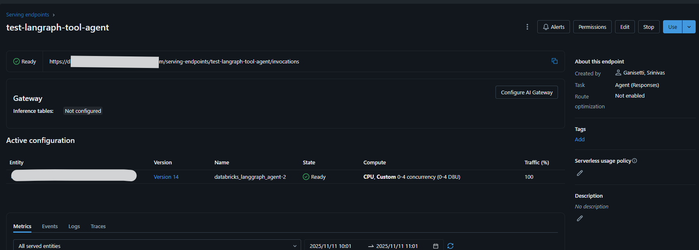
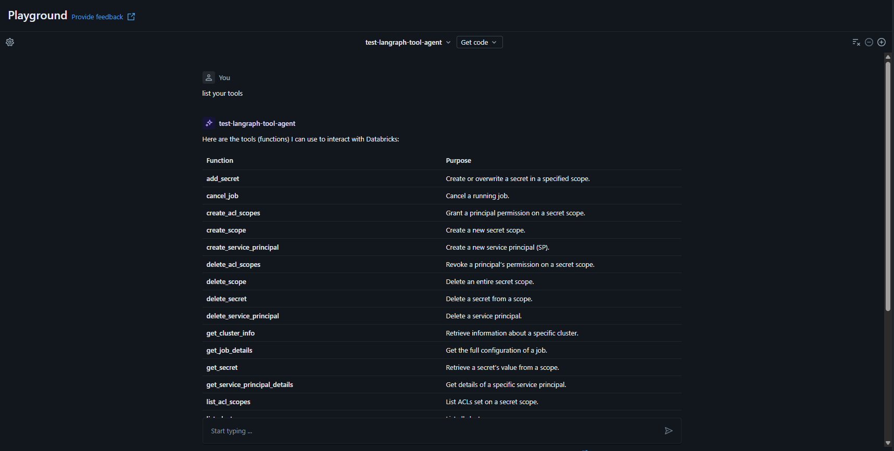
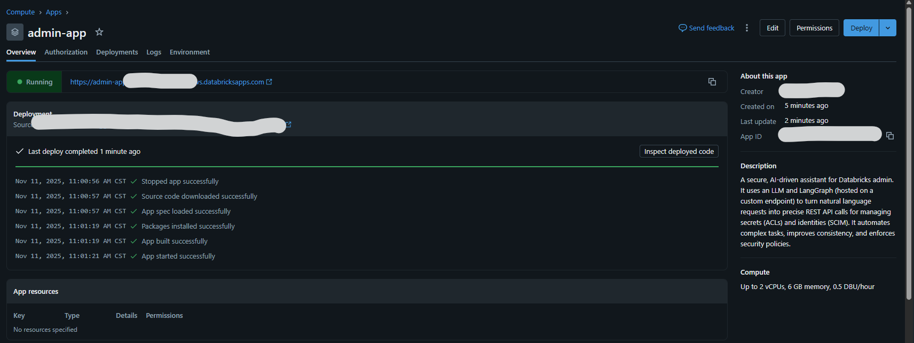
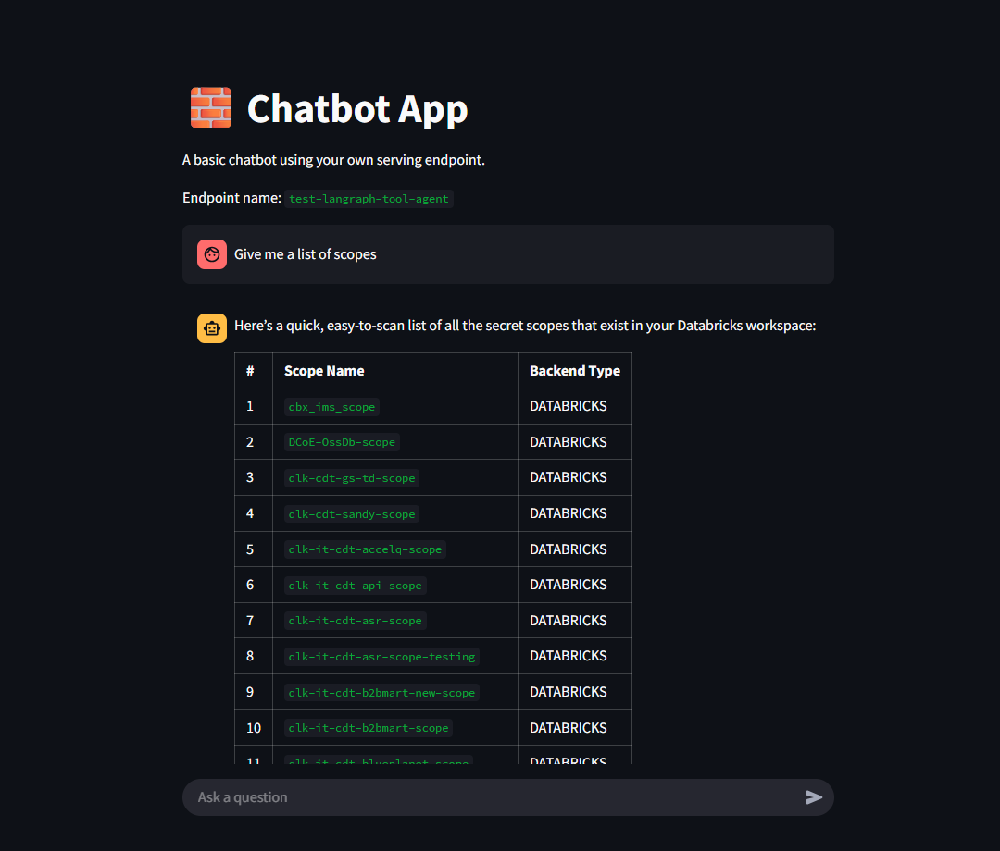

# LangGraph Admin Agent

A powerful AI agent built with LangGraph and deployed on Databricks for administrative task automation. This project provides a conversational interface to interact with Databricks admin APIs including Service Principals, Secrets, Clusters, Jobs.

## 🎯 Overview

This project demonstrates how to build and deploy an intelligent agent that can:
- **Manage Service Principals** - Create, list and delete service principals
- **Manage Secrets and Scopes** - Create and manage secrets across scopes and create or delete scopes
- **Cluster Operations** - List, terminate, and manage Databricks clusters
- **Job Operations**- List, Start, Stop Job runs

The agent uses LangGraph for orchestration, integrates with Databricks foundation models, and is deployed as a model serving endpoint for real-time interactions.

## 🏗️ Architecture

The project consists of three main components:

### 1. **Agent Model** (`agent_model.py`)
The core agent built using LangGraph that:
- Dynamically discovers and loads tools from the `tools.py` module
- Uses Databricks foundation models (GPT-OSS-20B) for reasoning
- Implements a graph-based workflow with tool execution nodes
- Wraps the agent for MLflow model serving compatibility

### 2. **Tools Module** (`tools.py`)
A comprehensive collection of LangChain tools that interface with:
- Service Principal Management (list, create, delete)
- Secret and Scopes Management (list scopes, create scopes, list secrets, create/delete secrets .etc)
- Cluster Operations (list, create, edit, delete)
- Job Operations (list, get, run, stop)

### 3. **Chatbot App** (`chatbot-app/`)
A Streamlit-based web interface that:
- Connects to the deployed model serving endpoint
- Provides an interactive chat interface
- Supports streaming responses
- Handles multiple message types (ChatCompletions, ChatAgent, ResponsesAgent)

## 📊 Deployment Flow

### Model Serving Endpoint 

Once your agent is logged to MLflow and deployed, serve the logged model through the serving UI. Now, you can access it through a Databricks Model Serving endpoint:



The serving endpoint provides:
- Real-time inference with low latency
- Automatic scaling based on demand
- Built-in monitoring and logging
- REST API access for integration

### Playground Testing

You can test your agent directly in the Databricks playground before deploying the full chatbot app:



The playground allows you to:
- Test agent responses interactively
- View tool calls and execution traces
- Debug and refine your prompts
- Validate tool integrations

### Chatbot Application

The deployed chatbot app should be running and once its confirmed link on the url to check your app:



**Chatbot UI :**



## 📦 Project Structure

```
Databricks-Langgraph-Admin-Agent/
├── agent_model.py              # Core LangGraph agent implementation
├── tools.py                    # Tool definitions for Databricks APIs
├── test_tools.py           # Unit tests for tools
├── sample-tool-bind-agent.ipynb # Test the agent and register the model
├── chatbot-app/
│   ├── app.py                 # Streamlit chatbot application
│   ├── app.yaml               # App configuration
│   ├── messages.py            # Message handling utilities
│   ├── model_serving_utils.py # Serving endpoint utilities
│   └── requirements.txt       # Python dependencies
└── static/
    ├── serving_endpoint.png   # Serving endpoint screenshot
    ├── playground.png         # Playground testing screenshot
    ├── chatbotapp.png         # Chatbot app overview
    └── chatbotappui.png       # Chatbot UI details
```

## 🔧 Key Components Explained

### Agent Model (`agent_model.py`)

The agent is structured around three main classes:

**`Graphbuilder`** - Constructs the LangGraph workflow:
- Initializes the foundation model with tool binding
- Discovers tools dynamically from the tools module
- Builds a graph with agent and tool execution nodes
- Handles tool schema compatibility

**`DatabricksAgentWrapper`** - MLflow serving wrapper:
- Implements the `ResponsesAgent` interface
- Converts incoming requests to LangGraph message format
- Executes the agent graph and returns responses
- Provides error handling and logging

**Agent Function** - Core reasoning logic:
- Receives user messages and conversation history
- Decides which tools to call based on context
- Manages the conversation flow

### Tools Module (`tools.py`)

Tools are defined using the `@tool` decorator and follow this pattern:
- Clear docstrings for the LLM to understand tool purpose
- Type-annotated parameters
- Returns JSON strings for structured responses
- Error handling with descriptive messages

### Chatbot App (`chatbot-app/app.py`)

The Streamlit app handles multiple agent formats:
- **ChatCompletions** - Standard chat format
- **ChatAgent** - Streaming agent responses
- **ResponsesAgent** - MLflow Responses format with tool visibility

## 🎓 Usage Examples

### Example 1: List Service Principals
```
User: "Show me all service principals in the workspace"
Agent: [Calls list_service_principal tool]
Response: Returns formatted list of service principals
```

## 🔐 Security Considerations

- **Token Management**: Never commit tokens to version control
- **Use Service Principals**: For production deployments, use SP authentication
- **Scope Permissions**: Grant minimal required permissions to the agent
- **Audit Logging**: Monitor agent actions through Databricks audit logs

## 📝 Deployment to Databricks

1. **Log the model to MLflow:**
```python
import mlflow
from agent_model import AGENT

with mlflow.start_run():
    mlflow.pyfunc.log_model(
        "agent",
        python_model=AGENT,
        registered_model_name="admin-agent"
    )
```

2. **Create a serving endpoint:**
   - Navigate to Machine Learning > Serving
   - Create new endpoint with the registered model
   - Configure compute and scaling settings

3. **Deploy the chatbot app:**
```bash
databricks apps create chatbot-app
```
4. **APP-SP permission:**
   - Your app creates a SP for you while deploying it , give this SP --> Can query permission to the model serving end point we created

6. **Configure app resources:**
   - Link the serving endpoint in `app.yaml`
   - Set environment variables
   - Deploy and test

## 🧪 Testing

The project includes test coverage in `test_tools.py`:
- Tests tool initialization
- Validates API call structure
- Tests error handling scenarios
- 

## 📚 Resources

- [LangGraph Documentation](https://langchain-ai.github.io/langgraph/)
- [Databricks Model Serving](https://docs.databricks.com/machine-learning/model-serving/index.html)
- [Databricks REST API](https://docs.databricks.com/api/workspace/introduction)
- [LangChain Tools](https://python.langchain.com/docs/modules/agents/tools/)

## 🙏 Credits & Acknowledgments

This project uses the Streamlit chatbot app template from the official [Databricks App Templates](https://github.com/databricks/app-templates/tree/main) repository. Special thanks to the Databricks team for providing excellent templates and documentation for building and deploying AI applications on Databricks.

The chatbot application structure (`chatbot-app/`) is based on the [streamlit-chatbot-app](https://github.com/databricks/app-templates/tree/main/e2e-chatbot-app) template, which has been customized for this LangGraph-based admin agent use case.


## 👥 Authors

Srinivas Ganisetti

---

**Note**: This is a demonstration project. Always follow your organization's security and deployment best practices when deploying AI agents in production environments.

**Additonal Note**: Yes, you guessed it right only this README.md was vibe coded 😉 


